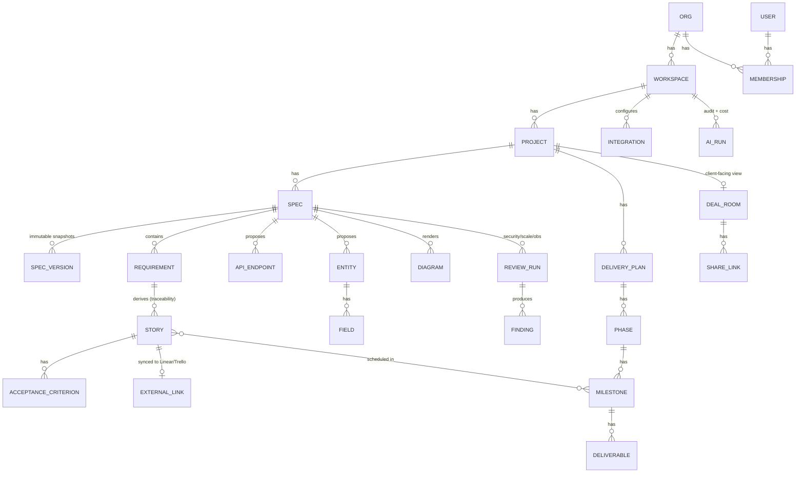
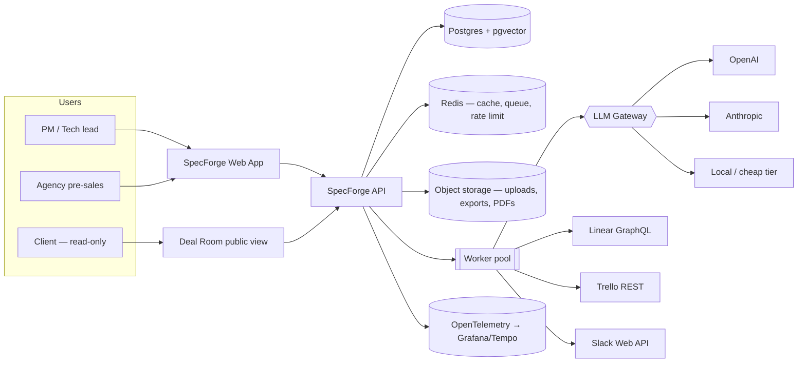
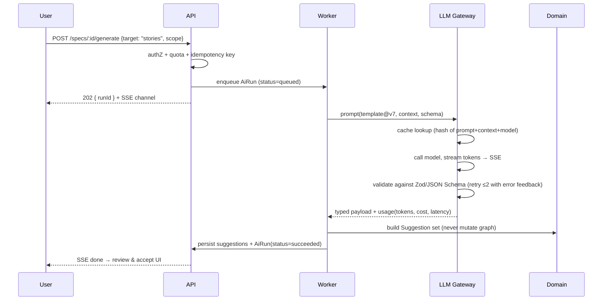
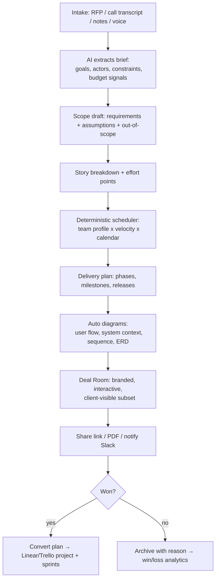

# SpecForge — Architecture

> **SpecForge** turns a rough idea or a client conversation into a structured, versioned, reviewable delivery artifact set — spec → user stories → API/data model → visual delivery plan (timeline, phases, flow diagrams) → tickets in Linear/Trello → notifications in Slack.
>
> Two audiences, one engine:
> **Internal mode** (PM / tech lead): specs, stories, API contracts, review packs.
> **Deal Room mode** (agency pre-sales): a client-facing, beautiful, shareable proposal with scope, phased timeline, release plan, charts and flow diagrams — generated from the same spec graph.

**Status:** design doc, v1.0
**Owner:** Dheeraj Gupta
**Last updated:** 2026-08-24

---

## 1. Problem and positioning

### 1.1 The problem

Two related, expensive failures happen at the start of software work:

1. **Specs are bad or missing.** Requirements live in Slack threads and half-written Notion pages. Ambiguity is discovered during implementation, where it costs 10–100x more to fix.
2. **Agencies lose deals in pre-sales.** A client asks "how will you build this, in what order, how long, what do we get in week 3?" The agency answers with a PDF hand-assembled in 2–3 days by a senior person. It's slow, inconsistent, and often the deciding factor in whether the deal closes.

Both failures are the *same* failure: **there is no structured, machine-readable representation of intended work** that can be validated, versioned, visualised, and pushed into execution tools.

### 1.2 Positioning (why this is not "another ChatGPT wrapper")

| Generic LLM chat | SpecForge |
| --- | --- |
| Produces prose | Produces a **typed artifact graph** (Spec → Requirement → Story → Endpoint → Entity → Milestone) validated against JSON Schema |
| Stateless | **Versioned, diffable, traceable** — every story links to the requirement it came from |
| No opinion | Ships **review packs** (security, scalability, observability, ambiguity) as first-class checks |
| Dead end | **Executable exits**: OpenAPI, SQL migrations, Linear/Trello issues, Slack digests, client-facing Deal Room |
| No audience separation | One graph, **two renderers**: engineer view and client view |

The moat is the **schema + traceability + delivery visualisation**, not the model.

### 1.3 Personas

| Persona | Primary job | Key surface |
| --- | --- | --- |
| **Agency owner / pre-sales lead** | Win the deal fast, look credible | Deal Room builder, timeline, cost/effort estimate |
| **Product manager** | Turn intent into unambiguous requirements | Spec editor, review packs, story generation |
| **Tech lead** | Sanity-check design before code | API/data model designer, ADR generator, scaffolding |
| **Engineer** | Know exactly what to build | Story detail, acceptance criteria, flow diagrams, ticket sync |
| **Client (external, read-only)** | Understand scope, trust the plan | Shared Deal Room link — timeline, phases, deliverables, flows |

---

## 2. Domain model

The whole product is a graph of typed nodes over a workspace. This is the part to get right; everything else is a renderer or a transport.



### 2.1 Core invariants

1. **Traceability is mandatory.** A `Story` cannot exist without a `requirement_id`. A `Milestone` deliverable must reference at least one `Story` or `Deliverable`. This is what makes coverage metrics possible and what makes the client timeline defensible.
2. **Versions are immutable.** `SpecVersion` stores a full JSON snapshot (content-addressed hash). Diffs are computed structurally over the graph, not over text.
3. **AI never writes directly to the graph.** Model output → JSON Schema validation → `Suggestion` record → explicit accept/reject by a human → graph mutation + audit entry. This single rule is the difference between a toy and a tool.
4. **Every tenant row carries `org_id`.** Enforced at the DB layer with Postgres Row-Level Security, not only in application code.

### 2.2 Artifact schemas (illustrative)

```ts
// Requirement — the atomic unit of intent
type Requirement = {
  id: string; specId: string;
  key: string;                 // "FR-012" / "NFR-003" — stable, human-citable
  kind: 'functional' | 'non_functional' | 'constraint' | 'assumption' | 'out_of_scope';
  title: string; body: string;
  priority: 'must' | 'should' | 'could' | 'wont';   // MoSCoW
  ambiguityScore: number;      // 0..1, from the ambiguity review pack
  openQuestions: string[];
  sourceRefs: SourceRef[];     // transcript timestamp, email, uploaded RFP page
};

type Story = {
  id: string; requirementId: string;          // hard traceability edge
  asA: string; iWant: string; soThat: string;
  criteria: { given: string; when: string; then: string }[];  // Gherkin-shaped
  estimate: { points: number; confidence: 'low'|'med'|'high'; basis: string };
  labels: string[]; milestoneId?: string;
  external?: { provider: 'linear'|'trello'|'jira'; id: string; url: string; syncedAt: string };
};

type Milestone = {
  id: string; phaseId: string; name: string;
  startDate: string; endDate: string;
  storyIds: string[]; deliverables: Deliverable[];
  clientVisible: boolean;                      // Deal Room filter
  demoNote?: string;                           // "what the client sees on this date"
};
```

---

## 3. System architecture

### 3.1 Context (C4 L1)



### 3.2 Containers (C4 L2)

| Container | Tech | Responsibility |
| --- | --- | --- |
| **Web app** | Next.js 15 (App Router), React 19, TS, Tailwind + shadcn/ui, Zustand + TanStack Query | Dashboard shell, spec editor, diagram canvas, Deal Room renderer |
| **API** | NestJS (TS) — modular, DI, clean layering | REST + tRPC-style typed contract, authZ, orchestration |
| **Domain core** | Pure TS package `@specforge/domain` | Entities, invariants, diff engine, estimation, zero I/O — 100% unit tested |
| **Worker** | BullMQ workers (same image, different entrypoint) | AI generation, ingestion, ticket sync, PDF render, digests |
| **LLM Gateway** | Internal service/module | Model routing, prompt registry, schema validation, retries, caching, token accounting |
| **Postgres 16 + pgvector** | Primary store | Graph, versions, embeddings for RFP/transcript retrieval |
| **Redis** | Cache + queue + rate limit | BullMQ, idempotency keys, response cache |
| **Object storage** | S3-compatible | Uploaded RFPs/transcripts, exported PDFs, diagram SVGs |

**Why NestJS + Next.js rather than FastAPI:** single language across domain, API and UI means the artifact types (`Requirement`, `Story`, `Milestone`) are literally the same TypeScript definitions end-to-end, derived from Zod schemas that also drive LLM structured output. That type continuity is the strongest correctness lever in this product. See ADR-001.

### 3.3 Layering inside the API (this is the part reviewers read)

```
apps/api/src/
  modules/
    specs/
      interface/        # controllers, DTOs, guards — HTTP only, no logic
      application/      # use-cases: GenerateSpecFromBrief, AcceptSuggestion, PublishVersion
      domain/           # entities, value objects, invariants, events (imported from @specforge/domain)
      infrastructure/   # Prisma repos, LLM gateway adapter, integration adapters
```

Rules enforced by ESLint boundary rules + CI:
- `domain` imports nothing from `application`/`infrastructure`.
- `application` depends on **ports** (interfaces), never on Prisma or an SDK.
- Adapters are the only place a provider SDK appears — so swapping Linear for Jira is a new adapter, not a refactor.

---

## 4. The AI layer

### 4.1 Pipeline



### 4.2 Design decisions

- **Structured output always.** Every generation task has a named prompt template (versioned in `packages/prompts`, e.g. `spec.stories@v7`) and a Zod schema. Invalid output → repair loop with the validation error appended → hard fail after 2 retries. No free-form parsing.
- **Tiered model routing.** Cheap/fast model for reformatting, splitting, labelling, ambiguity scoring; frontier model for spec synthesis, API design, review packs. Route resolved by task descriptor, overridable per workspace. Cost per run is recorded on `AiRun`.
- **Context assembly, not dumping.** For a project with an uploaded RFP + call transcript, retrieval is hybrid (pgvector + Postgres full-text) over chunked sources, plus the current spec subgraph. Every generated requirement carries `sourceRefs` so the UI can show "this came from transcript 12:41".
- **Deterministic where possible.** Estimation, timeline scheduling, coverage metrics and diffs are **pure functions in the domain layer** — not LLM calls. The model proposes effort points; the scheduler computes dates from points, team composition, working calendar and dependencies. This makes the client timeline reproducible and defensible.
- **Evaluation harness.** `packages/eval` holds a golden set of ~40 briefs with expected properties (schema validity, requirement coverage, no invented scope, criteria testability). Run in CI on prompt changes; results tracked over time. Human thumbs-up/down on every suggestion feeds the same dataset.
- **Guardrails.** PII redaction pass before any external model call (configurable per workspace); prompt-injection defence for uploaded documents (content treated as data, delimited and never granted instruction authority); per-workspace token budget with soft warn / hard stop.

### 4.3 Review packs (differentiator)

Each pack is a chain: retrieve relevant spec subgraph → checklist-driven prompt → structured `Finding[]` → severity + suggested patch.

| Pack | Checks (excerpt) |
| --- | --- |
| **Ambiguity** | vague quantifiers, undefined actors, missing error paths, untestable criteria |
| **Security** | authN/authZ per endpoint, tenant isolation, PII classification, audit needs, secret handling |
| **Scalability** | expected load stated? hot paths, N+1 risks, async candidates, caching, pagination, idempotency |
| **Observability** | logs/metrics/traces per flow, SLOs, alerting, failure visibility |
| **Delivery risk** | unestimated stories, single-point dependencies, milestones with no demoable output |

---

## 5. Deal Room — agency pre-sales mode

This is the feature that makes SpecForge sellable to service agencies, and it reuses the graph rather than adding a parallel system.

### 5.1 Flow



### 5.2 What the client sees

- **Approach & understanding** — restated problem, goals, assumptions, explicit out-of-scope (kills scope-creep arguments later).
- **Phased timeline** — Gantt-style, with "what you can click on" per milestone, not just task names.
- **Release plan** — feature-release table per phase with demo dates.
- **Charts** — scope split by module, effort distribution, cumulative value delivery (burn-up), team allocation.
- **Flow diagrams** — client-friendly user journey; engineers get the same graph rendered as sequence/ERD/system-context.
- **Commercials** — effort → rate card → phase-wise cost, optional ranges, payment milestones.
- **Interaction** — clients can comment on a milestone, request scope toggles ("drop this module → see time/cost recompute live"). That live recompute is the demo moment that wins deals.

### 5.3 Dual rendering

One graph, two projections, controlled by `clientVisible` flags and an audience-aware renderer:

| Node | Engineer view | Client view |
| --- | --- | --- |
| Requirement | full body, NFRs, open questions | grouped into capability bullets |
| Story | Gherkin criteria, points, deps | rolled up into deliverables |
| Endpoint / Entity | OpenAPI + ERD | hidden |
| Milestone | sprint, capacity, risk | date, deliverable, demo note |
| Diagram | sequence, ERD, system context | user journey, phase map |

Share links are signed, scoped, optionally password-protected and expiring, with per-view analytics (who opened, which section held attention — genuinely useful pre-sales signal).

---

## 6. Integrations

All integrations are **adapters behind a single port**, so the application layer never knows which tracker is in use.

```ts
interface TrackerPort {
  createIssues(batch: StoryDraft[], target: TrackerTarget): Promise<ExternalRef[]>;
  updateIssue(ref: ExternalRef, patch: IssuePatch): Promise<void>;
  listContainers(): Promise<TrackerTarget[]>;   // teams/projects or boards/lists
  handleWebhook(evt: unknown): Promise<DomainEvent[]>;
}
```

### 6.1 Linear

- **Transport:** GraphQL API; authenticate via OAuth2 for multi-tenant installs (per-workspace tokens, encrypted at rest) with personal API keys allowed for solo use.
- **Mapping:** Project → Linear Project; Milestone → Cycle or Project Milestone; Story → Issue (`issueCreate`); Acceptance criteria → issue description checklist; labels/estimate mapped to Linear labels/estimate field.
- **Bulk push:** batched mutations with concurrency cap, per-story idempotency key (`workspace:story:hash`) so a retried job never double-creates.
- **Inbound:** webhooks update `Story.externalStatus`, feeding delivery dashboards and client progress views.

### 6.2 Trello

- **Transport:** REST with `key` + user `token`; Trello grants a user token via the `1/authorize` route or OAuth 1.0 with configurable scope and expiration ([Trello authorization docs](https://developer.atlassian.com/cloud/trello/guides/rest-api/authorization/)), and cards are created through the [Cards API](https://developer.atlassian.com/cloud/trello/rest/api-group-cards/).
- **Mapping:** Project → Board; Phase → List; Story → Card; criteria → checklist items; milestone date → due date; labels → Trello labels.
- **Note:** Trello rate limits per key/token, so pushes go through the queue with token-bucket throttling and resumable batches.

### 6.3 Slack (and pluggable messaging)

- **Transport:** Slack app with bot token; `chat.postMessage` for rich, threaded, updatable Block Kit messages rather than incoming webhooks, since webhooks are locked to one channel and cannot update or thread ([Slack messaging docs](https://docs.slack.dev/messaging/)).
- **Events:**
  - spec published / version diff summary
  - review pack findings (critical findings ping the channel, rest thread)
  - Deal Room opened by client → "Acme opened the proposal, spent 6 min on Timeline"
  - milestone at risk (from tracker webhooks vs plan)
  - daily/weekly delivery digest
- **Interactivity:** Block Kit buttons for *Approve spec*, *Accept suggestion*, *Push to Linear* — signature-verified, 3s ack then async work.
- **Pluggable:** same `NotifierPort` implemented for Slack, MS Teams, Discord, email, in-app.

### 6.4 Reliability rules for all outbound integrations

Idempotency keys on every write · exponential backoff with jitter · per-provider circuit breaker · outbox pattern (domain event → `outbox` table → worker) so a failed Slack post can never roll back a spec publish · dead-letter queue with an admin replay UI · full request/response audit (redacted) per integration call.

---

## 7. Multi-tenancy, auth and security

- **Tenancy:** shared schema, `org_id` on every row, **Postgres RLS** with a session variable set per request (`SET LOCAL app.org_id`). Prisma middleware injects the org filter as a second belt. Optional dedicated schema for enterprise tier — the repository port makes this a config change.
- **Auth:** OAuth (Google/GitHub) + email magic link; sessions as short-lived JWT access + rotating refresh; org-scoped tokens.
- **AuthZ:** RBAC (owner, admin, editor, reviewer, viewer) plus resource-level grants for external collaborators; policy evaluated in one `PolicyService` (CASL-style ability definitions), never scattered `if (role === ...)` checks. Client share links are a separate capability-token path with no user session.
- **Data protection:** AES-256-GCM envelope encryption for integration tokens (KMS-backed key), TLS everywhere, PII tagging on uploaded sources, per-workspace toggle for "never send documents to external models".
- **Audit:** append-only `audit_log` (actor, action, resource, before/after hash, ip, ua) — required both for enterprise sales and to make AI accountability real.
- **Abuse/cost control:** Redis token-bucket rate limits per org and per user, AI quota per plan, hard stop with clear UX, alert at 80%.

---

## 8. Scalability and performance

| Concern | Approach |
| --- | --- |
| Slow AI calls | All generation is async via BullMQ; UI streams tokens over SSE; jobs are resumable and cancellable |
| Bursty load | Stateless API behind a load balancer, HPA on CPU + queue depth; workers scale independently by queue |
| Expensive reads | TanStack Query on the client; Redis cache for rendered Deal Rooms and diagram SVGs (invalidated by version hash) |
| Large specs | Graph fetched by subtree with cursor pagination; diff computed server-side, streamed |
| Vector search | pgvector with HNSW index, per-org partitioned tables; move to a dedicated vector DB only if recall/latency demands it (ADR-004) |
| Backpressure | Queue depth thresholds → shed non-critical jobs (digests) first, keep interactive generation lanes hot; separate queues per priority |
| Graceful degradation | Provider outage → fall back to secondary model, then to "draft manually" mode with a clear banner; product remains usable without AI |
| Hot path budget | p95 API read < 200 ms, Deal Room first paint < 1.5 s, spec generation first token < 3 s |

---

## 9. Observability

- **Tracing:** OpenTelemetry end-to-end — browser interaction → API → queue → LLM call → integration call, one trace id. LLM spans carry model, prompt template version, token counts, cost, cache hit.
- **Metrics (Prometheus):** `ai_run_duration_seconds`, `ai_run_cost_usd`, `ai_schema_retry_total`, `suggestion_accept_rate`, `queue_depth`, `integration_error_total{provider}`, `dealroom_view_total`.
- **Logs:** structured JSON with `org_id`, `run_id`, `trace_id`; redaction middleware for prompts/PII.
- **Product analytics:** spec coverage %, ambiguity score trend, idea→approved lead time, proposal→win rate, time-to-proposal. These double as the marketing claims.
- **Dashboards:** engineering (latency, errors, queue), AI (cost/quality/accept rate per template), tenant (usage vs quota).

---

## 10. Frontend architecture and design language

### 10.1 Shell

Dashboard-first application. Persistent left sidebar, collapsible, with grouped navigation:

```
◈ SpecForge            [workspace switcher ▾]
── OVERVIEW
   Home / activity
   Insights          (coverage, ambiguity, lead time, AI cost)
── DISCOVER
   Intake            (RFP, transcript, notes, voice)
   Briefs
── DESIGN
   Specs             (versions, diffs, review packs)
   Stories & backlog
   API & data model
   Diagrams
── DELIVER
   Delivery plan     (phases, milestones, Gantt)
   Releases
   Estimates & rate cards
── CLIENT
   Deal Rooms
   Share links & views
   Comments & approvals
── AUTOMATE
   Integrations      (Linear, Trello, Slack, Jira, GitHub)
   Notifications & digests
   Templates & prompt packs
── ADMIN
   Members & roles
   Audit log
   Usage & billing
   Settings
```

Command palette (⌘K) over every artifact and action; keyboard-first navigation; three-pane spec workspace (outline · editor · AI/review rail).

### 10.2 Visual direction — "Blueprint Noir"

An opinionated, niche theme rather than default-Tailwind-SaaS:

- **Base:** deep near-black canvas `#0B0D10`, elevated surfaces `#12151A`, hairline borders `rgba(255,255,255,0.07)`.
- **Accent:** a single electric signal colour — cyan-to-violet gradient `#5EE7FF → #8B7CFF` — used only for state and focus, never decoration.
- **Semantic scale:** amber = ambiguity, red = critical finding, emerald = accepted/approved, slate = draft.
- **Texture:** subtle blueprint grid at 3% opacity on planning surfaces; measured 1px rules; no drop-shadow soup.
- **Type:** Inter Tight / Geist for UI, JetBrains Mono for keys (`FR-012`), schemas and diffs. Tight tracking on headings, generous line-height in spec bodies (this app is read as much as clicked).
- **Motion:** 120–200 ms, ease-out; layout shifts animated with Framer Motion shared layout; streaming AI text with a caret shimmer; diagram transitions morph rather than cut.
- **Density:** two modes — Comfortable (client/Deal Room) and Compact (backlog, diff, admin tables).
- **Light theme:** "Blueprint Paper" — warm off-white `#FAF9F6`, ink `#14181D`, same accent. Deal Rooms default to light for client trust and print/PDF fidelity; app defaults to dark.
- **Deal Room theming:** per-client white-label — logo, accent, font pair, cover image; token-driven so a theme is a JSON object, and PDF export uses the same tokens.

### 10.3 Diagram and chart engines

| Need | Choice |
| --- | --- |
| Flow / sequence / ERD from spec graph | Mermaid render pipeline (server-side to SVG for PDF + caching) |
| Interactive editable flow canvas | React Flow with a layout pass (ELK.js) — nodes bound to spec entities, so editing the diagram edits the graph |
| Gantt / timeline | Custom SVG built on d3-scale (full control over milestones, demo markers, dependencies, drag-to-reschedule) |
| Charts (effort split, burn-up, allocation) | Recharts / visx with the theme tokens |
| PDF export | Server-side headless Chromium print of the Deal Room route, same CSS tokens |

---

## 11. Key architecture decisions (ADRs)

| # | Decision | Alternatives | Rationale |
| --- | --- | --- | --- |
| 001 | TypeScript end-to-end (NestJS + Next.js + shared domain package) | FastAPI + Next.js | One source of truth for artifact types; Zod schemas drive DB types, API contract, LLM structured output and UI forms simultaneously |
| 002 | Postgres as the only primary store (graph + vectors + queue-adjacent state) | Dedicated graph DB, separate vector DB | Graph is shallow and bounded; one transactional store keeps invariants, backups and RLS simple. Revisit at >10M chunks |
| 003 | AI output → validated Suggestion → human accept | Direct mutation | Correctness, auditability, trust; also yields a labelled dataset for evaluation |
| 004 | pgvector + hybrid search | Qdrant/Weaviate | Avoids a second stateful system pre-PMF; adapter boundary makes migration a swap |
| 005 | BullMQ + Redis for durable jobs | Temporal | Temporal is the better long-run answer for multi-step sagas; BullMQ + outbox + idempotency covers current needs at a fraction of the ops cost. Migration path documented |
| 006 | Deterministic scheduler, LLM only for effort proposal | LLM generates dates | Client timelines must be reproducible, explainable and recomputable on scope change |
| 007 | Slack `chat.postMessage` bot, not incoming webhooks | Webhooks | Threading, message updates, interactivity, multi-channel routing |
| 008 | Deal Room as an audience projection of the same graph | Separate proposal module | Zero drift between what was sold and what gets built — the core product insight |

Each ADR lives in `docs/decisions/NNN-*.md` with context, options, decision, consequences, and revisit triggers.

---

## 12. Repository layout

```
specforge/
├── apps/
│   ├── web/                  # Next.js dashboard + Deal Room renderer
│   ├── api/                  # NestJS API (modular clean architecture)
│   └── worker/               # BullMQ workers (AI, sync, digests, PDF)
├── packages/
│   ├── domain/               # entities, invariants, diff, scheduler, estimator (pure)
│   ├── schemas/              # Zod schemas → TS types + JSON Schema for LLM
│   ├── prompts/              # versioned prompt templates + registry
│   ├── integrations/         # linear/, trello/, slack/, jira/, github/ adapters
│   ├── ui/                   # design system: tokens, primitives, charts, Gantt
│   └── eval/                 # golden set, scorers, CI harness
├── infra/
│   ├── docker/               # Dockerfiles, docker-compose (local prod-like)
│   ├── terraform/            # ECS/Fly/Railway + RDS + Redis + S3 + secrets
│   └── otel/                 # collector, Grafana/Tempo/Prometheus config
├── docs/
│   ├── ARCHITECTURE.md
│   ├── IMPLEMENTATION_PLAN.md
│   ├── decisions/            # ADRs
│   ├── openapi.yaml
│   └── diagrams/
└── .github/workflows/        # lint, typecheck, test, eval, e2e, build, deploy
```

---

## 13. Failure modes and how the system behaves

| Failure | Behaviour |
| --- | --- |
| LLM provider 5xx / timeout | Retry with backoff → secondary provider → job marked `degraded`, user sees actionable banner, spec remains editable |
| LLM returns invalid JSON | Repair loop (≤2) with validation error injected; then hard fail with the raw output stored for debugging |
| Linear/Trello partial batch failure | Per-story idempotency; successful refs persisted; failed subset retried; UI shows per-row status, never "unknown" |
| Slack outage | Outbox retains events, replays on recovery; in-app notifications unaffected |
| Redis loss | Queue state lost → jobs re-derivable from `AiRun`/outbox rows in Postgres; reconciliation job on boot |
| Client opens a revoked share link | Signed token check fails → branded "link expired" page, event logged, owner notified |
| Runaway cost | Per-org budget guard trips mid-run, cancels queued jobs, notifies owner, preserves completed work |

---

## 14. What this architecture is deliberately *not* doing (yet)

Full agentic code generation, real-time multiplayer CRDT editing, self-hosted model serving, marketplace/billing platform, and Temporal-based sagas are all out of scope for v1. Each has a documented trigger condition in `docs/decisions/`. Stating these boundaries explicitly — with the conditions under which they change — is itself part of the senior signal.

---

## 15. Scaling narrative (interview-ready)

- **10x users:** stateless API + worker autoscale on queue depth; add read replica; move diagram/PDF rendering to its own worker pool; cache Deal Rooms at the edge by version hash.
- **100x users:** partition `chunks`/`ai_runs` by org and time; dedicated vector store; per-tenant queue fairness (weighted round-robin so one large org can't starve others); shard Postgres by org range or move largest tenants to dedicated schemas; move sagas to Temporal (ADR-005 trigger).
- **Cost curve:** aggressive prompt caching, cheaper model tiers for mechanical tasks, embedding reuse across versions, and streaming partial acceptance so users don't regenerate whole specs. Target: cost per generated spec falls as usage grows, tracked as an explicit SLO.
